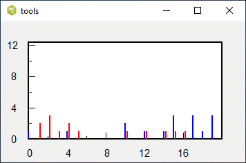
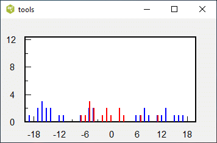
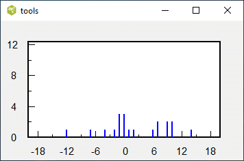
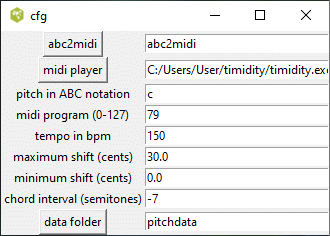

##  Pitch Discrimination Tests or Exercises

### Introduction

Good pitch discrimination is an important asset for any person planning to be
a music performer. String instruments which are temperature and humidity
sensitive need to retuned frequently. Fortunately there are now tuning meters
for people like me who have trouble determining whether the note is tuned too
low or high.

This program provides six different methods for measuring one's ability to
detect small pitch differences. The program is configurable and can run on
either the Windows or the Linux operating systems. However, the program in its
present state requires some knowledge of abc music notation, the midi
standard, tcl/tk, and the computer file system.

This program was put together rather quickly in order to test out various
ideas. To use this program you will need Tcl/Tk 8.5 or 8.6 installed on your
system, a midi player that can run invisibly, and the executable abc2midi.
There are numerous configuration options.

The program runs in the following manner. Each time the user clicks on a
button, the program generates a test abc file, executes abc2midi to convert it
into a midi file, and then forwards the file to a midi player. The user
responds by selecting the tone that is different, or indicating whether a
particular tone is higher or lower relative to another tone. Despite the
complexity of the program, it runs sufficiently fast to be interactive. Six
exercises are included in the program. The results of these exercises are
stored in separate data files in a folder chosen by the user.

### Background

The frequency of a note doubles in each octave. For example, the note A in the
lower octave is 220 Hz, 440 Hz in the middle octave, then to 880 Hz in the
next octave. An octave is divided into 12 semitones where each semitone rises
in frequency by a constant factor equal to the 12th root of two or
1.059460943. Most people can detect pitch difference smaller than a semitone.
Here we use pitch differences measured in cents where each semitone is divided
into 100 equal parts or cents.

### Exercises

Note that if you click the **Help** button after selecting one of the
exercises, brief instructions will be displayed in a frame below.

#### Warble

The program plays a continous tone and slowly modulates the pitch by a small
amount. The degree of this modulation is controlled by a slider. The goal is
to set the pitch modulation to the level where it is just audible. It is
recommended that you begin with a large modulation so you know what to listen
for. Gradually decrease the amount of modulation until it becomes
imperceptible. This is a quick way for measuring your pitch sensitivity. You
will find that it is easier to detect modulations in the higher octaves, and
if the tone is fairly simple. The way this can be configured is described in
another section.

#### High/Low and Chord High/Low

In this exercise, two tones are played and your object is to indicate whether
the first tone is higher or lower in pitch Frequently, you are aware of a
difference, but are may not be able to tell whether it is high or low. The
pitch difference varies with each trial. If you click on the **tools/plot**
menu button, a plot similar to below will be displayed.

This is a histogram of the correct (blue) and wrong (red) responses as a
function of the pitch differences. Most of the red responses concentrate at
the smaller pitch differences (in cents). The program continues to accumulate
the results until you delete the highlow.dat file. By default this file is
found in the folder called pitchdata. This file (if it exists) is read each
time the program is started and is replaced on exiting the program. The chord
high/low exercise is almost identical to the high/low exercise. The difference
is that the test tones are now embedded in two-tone chords -- the same test
tones and harmonizing tones. The second tone is above or below the test tone
by a fixed number of semitones which is set in the configuration page. The
question is whether it is easier or harder to detect the higher test tones in
this environment. The results are stored in a file called chordhighlow.dat.

#### Odd One Out and Chord Odd One Out

In this exercise, four tones are played in where one of the tones is played
slightly flat or sharp. Your goal is to select the the distinct tone by
clicking on one of the 4 buttons. Like the previous exercise, the pitch
differences vary from trial to trial and your responses are collected and
stored in the file called oddout.dat. A histogram similar to below is exposed
when you click on the menu item **tools/plot**.

The horizontal scale indicates pitch differences (positive or negative) of the
distinct tone. The number of correct responses and wrong responses are
indicated in blue and red respectively for each pitch difference.

#### Tuning

In this exercise, two tones are played. Your goal is to tune the second tone
using the slider so it sounds like the first You should play the sequence
using the **repeat** button after shifting the slider. When you believe the
two tones are identical, click the button labeled **Done**. Repeat this many
times so that you have enough data to plot.

There is no right or wrong so that all the counts are in blue. The counts
should concentrate near zero if you tune the notes correctly. All the results
are stored in the file tuning.dat.

### Configuration

Clicking on the **cfg** button will display a window like this.

The **abc2midi** entry box points to the executable abc2midi. The **midi
player** entry box points to the midi player executable. I find **timidity**
works best on both Linux and Windows; however, **timidity** requires a
SoundFont file and a configuration file **timidity.cfg** indicating where to
find the SoundFont. You can use the abc2midi and midi player buttons to
navigate to these executables.

**pitch in ABC notation** It sets the pitch of the test tone to be played in
all the exercises. The pitch is specified using the abc music notation
standard. Here are some examples:  
C Middle C  
c One octave above middle C  
c' Two octaves above middle C  
C, One octave below middle C  
_B B flat  
^F F sharp

**midi program (0 -127)** Note that not all midi programs are suitable. The
tone of some instruments may decay too fast, especially in the high registers.
Other instruments may have too much vibrato or tremolo. Ensemble programs are
too rich. The following instruments (midi program numbers) are recommend:
Brass (56-63), Reed (64-71), Pipe (72-79), and Synth Lead (80-87).

**tempo** beats per minute. Controls the duration of the tone sequence usually
consisting of 4 beat tones.

**maximum shift (cents)** and **minimum shift** controls the range of pitch
shifts selected by the random number generator. I recommend a range from 0 to
25. The plots go up to 25 presently.

**chord interval (semitones)** For the exercises chord high/low and chord odd
one out, this parameter determines the pitch of the chordal tone which is
played either above or below the test tone.

**data folder** This is the folder where the data files highlow.dat,
oddout.dat and tuning.dat. By default it is pitchdata; however, if you want to
save the results for different configurations (eg. different pitch, or
different midi program), or different users, you can use different names.

I do not recommend changing the configuration values while you are collecting
data. It will confound the results. Either delete the data files, or switch to
another folder.

The configuration variables are stored in a separate initialization file in
the same location as this program.

###  Internals

The program is quite simple. For each exercise there is an abc template. For
example the template for the high/low exercise is here.

    
    
    
    X:1
    T: pitch discrim
    M: 4/4
    L: 1/4
    K: C
    Q: 1/4 = $tempo
    %%MIDI program $prog
    $note z |$shift$note|
    
    

The variables tempo, prog, note, and shift are set by the program and are
substituted into the file to create an abc file tmp.abc. A simple procedure
out_and_play(abcfile) converts the abc file to a midi file and sends it to the
midi player. Here is the procedure coded in tcl/tk scripting language.

    
    
    proc out_and_play {abcfile} {
    global midi
    set outhandle [open tmp.abc w]
    puts $outhandle $abcfile
    close $outhandle
    set cmd1 "exec $midi(abc2midi) tmp.abc"
    catch {eval $cmd1} out1
    set cmd2 "exec $midi(midiplayer) tmp1.mid "
    catch {eval $cmd2} out2
    }
    

There are two functions in the **tools** menu for exposing the operation of
this program. **tools/tmp.abc** will display the contents of the tmp.abc file
for the current trial in a separate window. **tools/console** shows the
communication between this program with the external executables. The console
is useful for diagnosing problems with the program or configurations.

###  Epilogue

Besides your hearing and musical training, the results of this program depend
upon many other factors. The tones are created by a midi synthesizer, so the
soundfont and the characterisitics of the synthesizer (reverberation, vibrato
chorus level, and etc.) are important. The sound is played by your speakers
(or headphones) at a certain audio level, and there may be ambient noise in
your room. Your sensitivity to pitch differences depends upon both the pitch
and timbre of the tone. Generally, it is easier to detect pitch differences in
the higher octaves. If the test tone has vibrato, or embedded in a chord with
many overtones, the task is more difficult. A chordal tone above the test tone
may be more salient than the test tone. When you are collecting data, you
should try to keep all these factors fixed.

